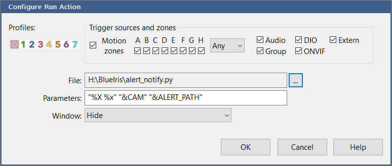

# Pushover Blue Iris Integration

Python script to send Blue Iris motion detection alerts with an attached image to [Pushover.](https://pushover.net/)

## Setup Instructions

### Step 1: Blue Iris Configuration

1. Open settings for camera you want to receive notifications from
1. On Trigger tab: Check 'Capture an alert list image', and 'Store alert images as hi-res files'
   1. This setting is required for the `&ALERT_PATH` macro to work.  Without it you'll get a notification without the alert image
1. On Alerts tab: Click 'On alert...' button
1. In Action set window press the + and choose 'Run a program or script'
   1. For File: Choose this python script
   1. For Parameters set it exactly to: `"%X %x" "&CAM" "&ALERT_PATH"` 

1. Repeat for each camera you want to receive notifications from

### Step 2: Required Script Configuration in `alert_notify.py`

1. `P_USER`, `P_TOKEN`: Pushover User Key, and API Token/Key
1. `ALERT_DIR`: Directory where alert images are saved.  
   1. You can find this path in Blue Iris Settings --> 'Clips and archiving' tab --> Clicking on 'Alerts' in the Folders section

